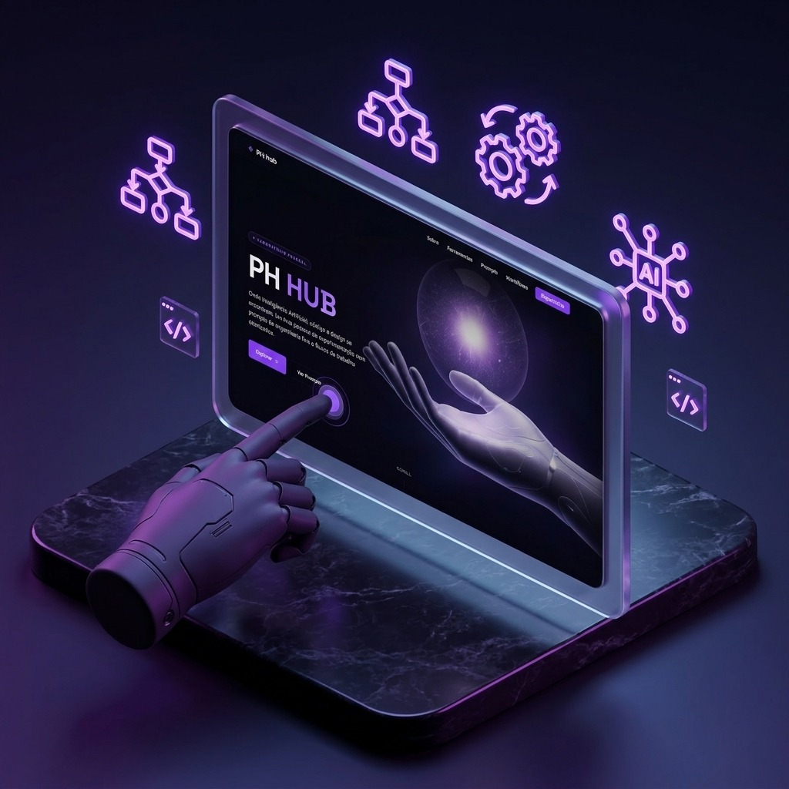
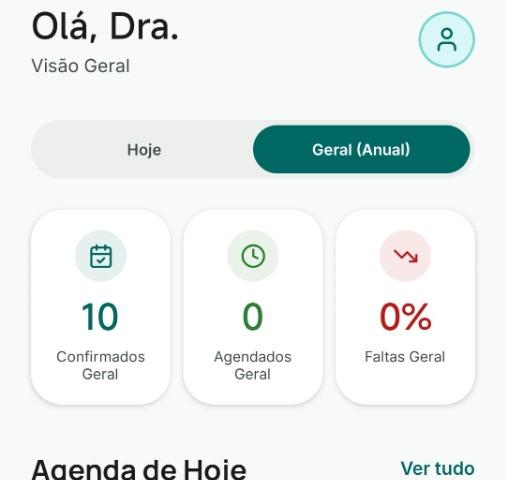

  

  <strong>Desenvolvedor Full Stack | Freelancer Autônomo | Especialista em Automação & Agentes de IA</strong>

  
  
  

---

## 👨‍💻 Sobre Mim

  

Sou **Desenvolvedor Full Stack** focado na construção de aplicações escaláveis e de alta qualidade. Atuo como **Freelancer Autônomo**, unindo arquitetura de software sólida com o poder da **Automação e Agentes de IA** para acelerar entregas e gerar valor real.

---

## ⚡ Três Pilares de Desenvolvimento

<table border="0" width="100%">
  <tr>
    <td width="33.3%" valign="top">
      <h3>⚡ Performance</h3>
      
Aplicações otimizadas desde o dia zero. Zero gargalos, foco em velocidade e alta eficiência.

    </td>
    <td width="33.3%" valign="top">
      <h3>🎨 UX/UI Intuitiva</h3>
      
Interfaces limpas e responsivas. Design estratégico para resolver problemas sem atritos.

    </td>
    <td width="33.3%" valign="top">
      <h3>🏗️ Código Durável</h3>
      
Arquitetura limpa (SOLID) desenhada para escalar com segurança e facilitar manutenções.

    </td>
  </tr>
</table>

---

## 📐 Metodologia de Trabalho

*Processo enxuto e estruturado para garantir máxima excelência técnica:*

<table border="0" width="100%">
  <tr>
    <td width="50%" valign="top">
      <h4>🔍 01. Planejamento</h4>
      
Alinhamento profundo de requisitos e estratégia técnica antes de codar.

    </td>
    <td width="50%" valign="top">
      <h4>⚙️ 02. Arquitetura</h4>
      
Modelagem de dados otimizada e sistemas desenhados para alta disponibilidade.

    </td>
  </tr>
  <tr>
    <td width="50%" valign="top">
      <h4>🤖 03. IA Assistida</h4>
      
Desenvolvimento ágil potencializado por IA, sem abrir mão do controle lógico.

    </td>
    <td width="50%" valign="top">
      <h4>🛡️ 04. Qualidade</h4>
      
Testes rigorosos e refatoração constante para entregar código resiliente.

    </td>
  </tr>
  <tr>
    <td colspan="2" align="center" valign="top">
      <h4>🚀 05. Lançamento & Evolução</h4>
      
Suporte completo de infraestrutura e monitoramento pós-deploy.

    </td>
  </tr>
</table>

---

## 🚀 Projetos em Destaque

<table width="100%" border="0">
  <tr>
    <td width="50%" valign="top">
      <h3>🧪 PHHub</h3>
      
      
<strong>Centralizador de Automações & MCPs</strong>

      
Hub avançado desenvolvido para orquestrar fluxos de trabalho assistidos por IA e servidores MCP em uma interface reativa e moderna.

      

        
        
        
        
      

      <a href="https://github.com/PauloHenrrq/PH-Hub" target="_blank">💻 Repositório</a> | 
      <a href="https://ph-hub-six.vercel.app/" target="_blank">🌐 Deploy</a>
    </td>
    <td width="50%" valign="top">
      <h3>🏥 OdontoSync</h3>
      
      
<strong>SaaS Clínico com Automação via WhatsApp</strong>

      
Plataforma para clínicas com painel inteligente de agendamentos e portal do paciente com automação de ponta a ponta.

      

        
        
        
        
      

      <a href="https://github.com/PauloHenrrq" target="_blank">💻 Repositório</a>
    </td>
  </tr>
</table>

---

## 🛠️ Stack Tecnológica & Ecossistema

  

<table align="center" border="0" width="100%">
  <tr>
    <td width="33%" align="center" valign="top">
      <strong>🌐 Frontend Moderno</strong> 
      <em>Next.js, React, React Native, TypeScript, TailwindCSS</em>
    </td>
    <td width="33%" align="center" valign="top">
      <strong>⚙️ Backend & Dados</strong> 
      <em>Node.js, Express, Prisma, PostgreSQL, MySQL</em>
    </td>
    <td width="33%" align="center" valign="top">
      <strong>🤖 IA & Automação</strong> 
      <em>Python, Docker, MCP, AI Agents, Bash</em>
    </td>
  </tr>
</table>

---

## 📊 Atividade & Estatísticas no GitHub

  
  

  

